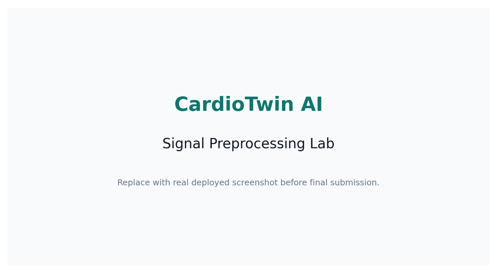
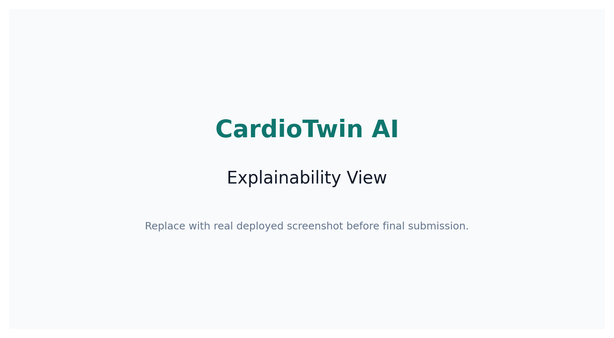
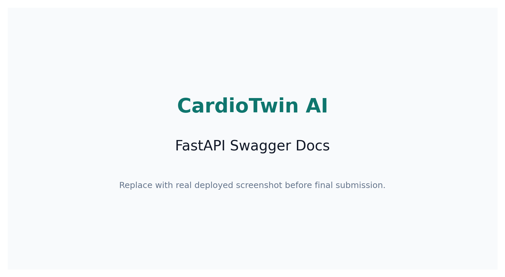
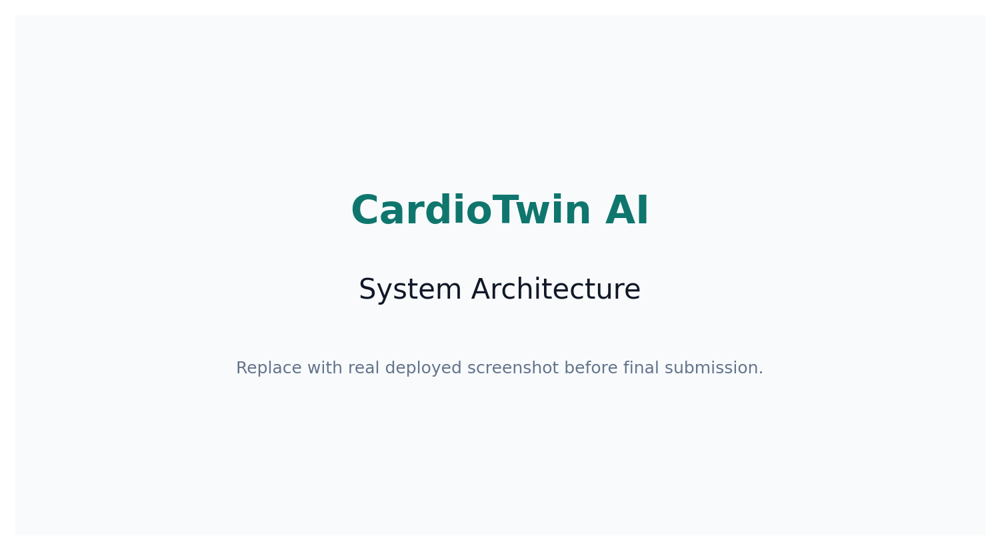

# CardioTwin AI: Multimodal Health Risk Digital Twin

CardioTwin AI is a multimodal healthcare intelligence system that combines PPG signals, patient vitals, symptoms, medical report images, ECG/report OCR, and time-series health trends to generate explainable cardiovascular risk insights with doctor-friendly and patient-friendly summaries.

**Medical disclaimer:** This system is for educational and research purposes only and should not be used as a substitute for professional medical advice, diagnosis, or treatment.

## GitHub Project Description

CardioTwin AI is a multimodal healthcare AI system that fuses PPG signals, patient vitals, symptoms, and medical report images to generate explainable cardiovascular risk insights with trend monitoring, emergency alerts, and clinical-style PDF reports.

## Advanced Features Added

- Live Digital Twin Monitor with simulated wearable-style readings at `/live-simulation`.
- Critical Alert Engine at `/check-alerts` for emergency warning patterns.
- Dual-audience outputs at `/generate-summary`: `Clinical Assist` for medical practitioners and `Plain-Language Guidance` for common users.
- Time-series health trend prediction at `/analyze-trends` using sample or saved history.
- Physiological anomaly detector at `/detect-anomaly` using transparent statistical rules.
- Reliability-adjusted late fusion with effective modality weights, confidence reasons, missing inputs, and safety escalation warnings.
- Personalized health coach recommendations at `/generate-recommendations`.
- Synthetic Health Case Simulator at `/demo-patients` with eight demo cases.
- Longitudinal Health Memory using SQLite through `/save-reading`, `/history`, and `/compare-last-reading`.
- Voice symptom input in the browser when SpeechRecognition is available.
- Health Twin Chat Assistant at `/chat`, grounded only in the current report/context.
- Clinical-style PDF report generator with risk, summaries, recommendations, confidence, and limitations.

## Latest Algorithm and Audience Modes

The multimodal backend now uses reliability-adjusted late fusion instead of blindly applying fixed weights. Each modality keeps its configured weight, but the final effective weight is adjusted using available evidence and confidence. Missing inputs reduce confidence rather than falsely reducing risk.

The final fusion response includes two audience-specific modes:

- `clinician_assist`: practitioner-facing decision support with triage priority, clinical snapshot, key findings, data quality, review questions, recommended actions, and a handoff note.
- `patient_guidance`: common-user guidance with simple status, what the score means, what to do now, when to seek urgent help, and clear non-diagnosis wording.

Emergency patterns are handled with safety escalation floors, so warning combinations such as chest pain with breathing difficulty are not hidden by averaging. The system still remains an educational and research prototype, not a diagnosis or treatment tool.

## Problem Statement

Most health AI demos analyze a single input type, such as a wearable signal or a vitals table. Real clinical reasoning is multimodal: waveform quality, blood pressure, sleep, activity, symptoms, medication context, and reports all matter together. This project demonstrates how those inputs can be collected, analyzed independently, fused with transparent weights, and summarized for both clinicians and patients.

The current implementation is a research-grade educational prototype. It uses rule-based plus ML-ready hybrid scoring when a validated clinical dataset is unavailable.

## Why Multimodal AI Is Useful In Healthcare

- PPG signals provide continuous physiological patterns but can be noisy.
- Tabular vitals capture structured risk factors such as BP, BMI, SpO2, sleep, and activity.
- Text notes reveal symptoms and context that numeric models miss.
- Images and scanned reports can contain ECG impressions, BP values, lipids, glucose, and other findings.
- Late fusion makes the final score easier to inspect because each modality keeps its own score and contribution.

## Multimodal Features

- PPG CSV upload with waveform preview data, cleaning, peak detection, artifact estimation, signal quality scoring, and BP trend prediction.
- Patient form for age, gender, height, weight, HR, BP, SpO2, sleep, activity, smoking, diabetes, hypertension, and existing risk factors.
- Symptoms and notes analysis for chest pain, dizziness, shortness of breath, fatigue, headache, palpitations, lifestyle notes, and emergency warning phrases.
- ECG/report image upload with OCR-ready extraction and demo fallback report text.
- Multimodal risk fusion using configurable weights.
- Overall health risk score and cardiovascular risk category.
- Signal quality explanation.
- Symptom-based risk interpretation.
- Doctor-friendly structured summary.
- Patient-friendly warning insights.
- Confidence score and modality influence chart.
- Downloadable PDF report when `reportlab` is installed, with a text fallback.
- Demo mode with bundled sample data.

## Multimodal System Architecture

```text
React dashboard
  -> PPG CSV upload / patient form / symptoms / report image
  -> FastAPI routes
      /upload-signal
      /analyze-signal
      /analyze-tabular
      /analyze-text
      /analyze-image
      /multimodal-risk
      /generate-report
  -> Independent modality analyzers
      signal_model.py
      tabular_model.py
      text_model.py
      image_model.py
  -> late-fusion scoring
  -> explanation and report services
  -> doctor and patient summaries
```

### Fusion Strategy

Configured weights live in [backend/app/config.json](backend/app/config.json):

```text
0.35 signal + 0.30 tabular + 0.20 text + 0.15 image/report
```

At runtime, CardioTwin converts those configured weights into reliability-adjusted effective weights. Clean and complete modalities contribute more; missing, noisy, or demo/fallback modalities contribute less and reduce confidence.

Risk bands:

- `0-25`: Low Risk
- `26-50`: Mild Risk
- `51-75`: Moderate Risk
- `76-100`: High Risk

## Multimodal Tech Stack

- Backend: FastAPI, Pydantic, NumPy, Pandas, SciPy, Pillow, pytesseract, reportlab
- Frontend: React, Vite, lucide-react, SVG/CSS charts
- Existing research pipeline: Python, Scikit-learn, PyTorch, Streamlit, FastAPI modules under `src/` and `app/`

## Multimodal Folder Structure

```text
backend/
  app/
    main.py
    config.json
    routes/
      signal_routes.py
      tabular_routes.py
      text_routes.py
      image_routes.py
      fusion_routes.py
      report_routes.py
    models/
      signal_model.py
      tabular_model.py
      text_model.py
      image_model.py
      fusion_model.py
    services/
      preprocessing.py
      feature_extraction.py
      explanation_service.py
      report_generator.py
    utils/
      config.py
      disclaimer.py
      validators.py
    data/
      sample_ppg.csv
      sample_patient.json
      sample_report.png
  requirements.txt

frontend/
  index.html
  package.json
  src/
    App.jsx
    main.jsx
    styles.css
    components/
      SignalUpload.jsx
      PatientForm.jsx
      SymptomInput.jsx
      ImageUpload.jsx
      RiskDashboard.jsx
      SignalChart.jsx
      ModalityContribution.jsx
      DoctorSummary.jsx
      PatientSummary.jsx
    pages/
      Home.jsx
      Dashboard.jsx
    services/
      api.js
```

The original CardioTwin PPG research pipeline remains in `src/`, `app/streamlit_app.py`, `scripts/`, `docs/`, `reports/`, and `tests/`.

## How To Run Backend

```bash
cd backend
python -m venv .venv
.venv\Scripts\activate
pip install -r requirements.txt
uvicorn app.main:app --reload
```

Backend URL: `http://127.0.0.1:8000`

API docs: `http://127.0.0.1:8000/docs`

OCR note: `pytesseract` requires the Tesseract OCR executable installed on the machine for real image OCR. If it is not installed, the app still works with text/demo fallback behavior.

## How To Run Frontend

Open a second terminal:

```bash
cd frontend
npm install
npm run dev
```

Frontend URL: `http://127.0.0.1:5173`

If the backend runs on a different URL, create `frontend/.env`:

```text
VITE_API_URL=http://127.0.0.1:8000
```

## Multimodal API Endpoints

- `GET /` returns project status, fusion weights, and disclaimer.
- `GET /health` checks API health.
- `POST /upload-signal` accepts a PPG CSV upload and returns column detection, sample count, sampling rate, and preview values.
- `POST /analyze-signal` returns cleaned signal chart points, detected peaks, signal quality, reliability, HR estimate, BP trend prediction, signal risk score, and warning flags.
- `POST /analyze-tabular` returns structured vitals summary, BP category/trend, tabular risk score, feature contributions, and warning flags.
- `POST /analyze-text` returns matched symptoms, symptom severity, text risk score, and emergency warnings when present.
- `POST /analyze-image` returns OCR text, extracted values, image/report risk score, and warning flags.
- `POST /multimodal-risk` returns final risk score, cardiovascular risk category, BP trend prediction, effective modality contributions, confidence score, clinician assist output, plain-language patient guidance, limitations, and disclaimer.
- `POST /generate-report` returns a downloadable report.
- `GET /live-simulation` returns simulated wearable readings.
- `POST /check-alerts` returns emergency alert level and recommended action.
- `POST /generate-summary` returns practitioner-facing `clinician_assist` and common-user `patient_guidance` modes.
- `POST /analyze-trends` returns BP, HR, SpO2, sleep, risk, and signal-quality trends.
- `POST /detect-anomaly` returns physiological anomaly flags.
- `POST /generate-recommendations` returns lifestyle and monitoring recommendations.
- `GET /demo-patients` returns synthetic health case simulator patients.
- `POST /save-reading`, `GET /history`, and `GET /compare-last-reading` provide SQLite health memory.
- `POST /chat` answers questions using the current report context only.

## Demo Workflow

1. Start the FastAPI backend.
2. Start the React frontend.
3. Open the dashboard.
4. The page runs demo analysis automatically with bundled sample inputs.
5. Optionally upload a PPG CSV with columns like `time,ppg`.
6. Edit patient vitals and symptoms.
7. Upload an ECG/report image or leave demo mode active.
8. Click `Run Analysis`.
9. Review risk score, BP prediction, signal chart, modality contribution chart, summaries, and warning flags.
10. Click `Export Report` to download the report.

## Screenshots

Replace these placeholders with deployed screenshots after running the dashboard.

| Dashboard | Signal Quality | Report Export |
| --- | --- | --- |
| `assets/dashboard_home.png` | `assets/signal_lab.png` | `assets/api_docs.png` |

## Multimodal Limitations

- This is not a medical device, not a diagnosis system, and not suitable for treatment decisions.
- Risk scoring is transparent and educational; it is not clinically validated.
- Real BP prediction from PPG requires governed datasets, calibration, external validation, and careful leakage control.
- OCR can fail on low-quality scans or handwriting.
- Symptom analysis includes basic negation and warning combinations, but it can still miss timing, severity, and clinical nuance.
- Image analysis currently extracts report-like text and values; it does not implement a validated ECG deep learning model.
- Confidence scores describe input completeness and rule consistency, not clinical certainty.

## Future Scope

- Train on real clinical datasets with subject-wise validation.
- Add ECG deep learning model support.
- Integrate wearable device streaming.
- Add continuous monitoring and trend alerts.
- Use federated learning for privacy-preserving model updates.
- Build a doctor dashboard with longitudinal patient review.
- Add explainable AI methods such as SHAP and LIME.
- Add configurable institutional thresholds and audit logs.
- Improve OCR with layout-aware medical report parsing.
- Mobile app.
- Cloud deployment.
- Integration with smartwatches.

## Deployment

The multimodal React + FastAPI stack has production container files and a dedicated compose file:

```bash
docker compose -f docker-compose.multimodal.yml up --build
```

Open `http://127.0.0.1:8080` for the production Nginx-served frontend. The frontend proxies `/api/*` to the backend container. See [docs/MULTIMODAL_DEPLOYMENT.md](docs/MULTIMODAL_DEPLOYMENT.md) for environment variables, health checks, and E2E testing.
## Medical Disclaimer

This system is for educational and research purposes only and should not be used as a substitute for professional medical advice, diagnosis, or treatment.

---

## Legacy CardioTwin AI PPG Research Pipeline
# CardioTwin AI

Self-supervised PPG intelligence platform for predictive health signal analytics.

[](https://github.com/Pruthvi226/CardioTwin_AI/actions/workflows/python-ci.yml)


CardioTwin AI is an end-to-end AI engineering project for wearable PPG signal analytics. It cleans raw signal input, extracts statistical, morphology, frequency-domain, and signal-quality features, builds spectrogram images for a Computer Vision branch, trains multiple ML/deep-learning models, adds explainability and uncertainty flags, serves predictions through FastAPI, and presents the workflow in a polished Streamlit dashboard.

**Research demo only. Not for clinical diagnosis or medical decision-making.**

## Demo Screenshots

> Replace placeholder screenshots with real deployed dashboard screenshots before final submission.

| Dashboard | Signal Lab | Explainability |
| --- | --- | --- |
|  |  |  |

| Model Comparison | API Docs | Architecture |
| --- | --- | --- |
|  |  |  |

## Why This Project

PPG signals are common in wearable devices, but they are noisy, subject-dependent, and difficult to use directly for AI modeling. This project demonstrates the complete AI workflow an internship recruiter expects: dataset preparation, preprocessing, feature engineering, model training, evaluation, visualization, reporting, API serving, and documentation.

## Internship JD Alignment

- Designing and training AI/ML models: Scikit-learn baselines, CNN-LSTM, Transformer-ready encoder, SSL encoder.
- Data preprocessing and feature engineering: filtering, resampling, windowing, signal quality, morphology, frequency features.
- Python AI libraries: PyTorch, Scikit-learn, Pandas, NumPy, SciPy.
- AI automation: one-command pipeline and automated NLP-style report generation.
- Evaluation and optimization: metrics, model comparison, confidence, uncertainty, risk flags.
- Visualizations and reports: Streamlit dashboard, plots, generated experiment report, model card.
- NLP, CV, Predictive Modeling: report generator, spectrogram CV branch, classification/regression-style tasks.

## Key Features

- Synthetic and real dataset modes.
- Subject-wise split support for biosignal leakage control.
- Missing-value handling, smoothing/filtering, normalization, window segmentation.
- Signal quality scoring with noise and artifact warnings.
- Handcrafted statistical, morphology, and frequency-domain features.
- Spectrogram generation under `data/processed/spectrograms/`.
- Classical ML, CNN-LSTM, Transformer-ready, and SSL model families.
- Local vector similarity index for retrieving comparable PPG windows during inference.
- Confidence, uncertainty, and risk-flag prediction payloads.
- Explainability through feature attribution and signal saliency.
- FastAPI endpoints for inference and model metadata.
- Streamlit workspace with live intake, prediction, evidence, model, and records views.
- Local CSV experiment tracking under `reports/metrics/experiment_runs.csv`.
- Docker and Docker Compose support.
- CI tests with GitHub Actions.

## System Architecture

```text
Raw PPG CSV
  -> preprocessing
  -> window segmentation
  -> signal quality assessment
  -> feature extraction
  -> spectrogram generation
  -> local vector index for similar-window retrieval
  -> model training and evaluation
  -> explainability and uncertainty
  -> Streamlit dashboard / FastAPI API
  -> generated reports and model cards
```

See `docs/SYSTEM_ARCHITECTURE.md`.

## Tech Stack

Python, NumPy, SciPy, Pandas, Scikit-learn, PyTorch, Matplotlib, Streamlit, FastAPI, Uvicorn, Docker, GitHub Actions.

## Dataset Modes

### Synthetic Demo Mode

Used only to verify the full pipeline and run the demo without external datasets.

```bash
python scripts/run_full_pipeline.py --dataset synthetic --stage all
```

Synthetic demo results verify the pipeline only. Real-world performance requires subject-wise evaluation on real wearable datasets.

### Real Dataset Mode

Real mode expects a manually prepared CSV:

```text
data/raw/real_ppg.csv
```

Required columns:

```text
subject_id,time,ppg,fs,stress_label,quality_label,sbp,dbp,heart_rate,activity
```

Suggested public dataset: WESAD or another wearable/PPG-style dataset with proper usage rights. Convert it to the schema above, then run:

```bash
python scripts/run_full_pipeline.py --dataset real --stage all
```

## ML Pipeline

1. Generate or load dataset.
2. Validate columns and labels.
3. Clean missing values and outliers.
4. Apply PPG-band filtering and normalization.
5. Segment into 8-second windows.
6. Score signal quality and artifact risk.
7. Extract handcrafted features.
8. Generate spectrogram arrays/images.
9. Build a persisted local vector index for similar-window retrieval.
10. Split subjects into train/validation/test.
11. Train and compare model families.
12. Save metrics, plots, reports, model card, and experiment tracker rows.

## Models Used

- Logistic Regression
- Random Forest
- Gradient Boosting
- SVM-ready classical baseline
- CNN-LSTM sequence model
- Transformer encoder classifier
- Self-supervised masked reconstruction encoder
- Spectrogram CNN branch

## Evaluation

Classification metrics:

- Accuracy
- Precision
- Recall
- F1-score
- Weighted F1
- Confusion matrix
- ROC-AUC when applicable

Regression/score metrics:

- MAE
- RMSE
- R2 score

Saved outputs:

- `reports/metrics/classification_metrics.json`
- `reports/metrics/regression_metrics.json`
- `reports/figures/confusion_matrix.png`
- `reports/figures/model_comparison.png`
- `reports/figures/feature_importance.png`

## Explainability

Explainability modules live in `src/explainability/`:

- Feature attribution for Scikit-learn models.
- SHAP-compatible fallback interface.
- Signal saliency from important time-region estimates.
- Evidence view with top features, signal saliency, and similar-window retrieval.

## Dashboard

Run:

```bash
streamlit run app/streamlit_app.py
```

Dashboard views:

1. Workbench: live prediction, review status, signal quality, similar windows, and decision export.
2. Signal: raw signal, cleaned signal, selected-window quality, and spectrogram input.
3. Evidence: top features, feature importance, saliency, explanation notes, and feature CSV export.
4. Models: classification/regression metrics, model comparison, feature importance, and vector-index status.
5. Records: source rows, project asset readiness, generated report, and submission manifest export.

## API

Run:

```bash
uvicorn src.api.main:app --reload
```

Endpoints:

- `GET /`
- `GET /health`
- `POST /predict`
- `GET /model-info`
- `GET /sample-response`

Example response:

```json
{
  "project": "CardioTwin AI",
  "prediction": "stress_like_pattern",
  "confidence": 0.78,
  "uncertainty": "medium",
  "signal_quality": 0.62,
  "risk_flag": "acceptable_demo_prediction",
  "top_features": ["peak_interval_std", "spectral_entropy", "signal_energy"],
  "similar_windows": [
    {"rank": 1, "similarity": 0.94, "metadata": {"window_id": 12, "stress_label": 1}}
  ],
  "disclaimer": "Research demo only. Not for clinical diagnosis or medical decision-making."
}
```

## How To Run Locally

```bash
python -m venv venv
venv\Scripts\activate
pip install -r requirements.txt
python scripts/run_full_pipeline.py --dataset synthetic --stage all --config config.yaml
streamlit run app/streamlit_app.py
```

API:

```bash
uvicorn src.api.main:app --reload
```

Tests:

```bash
python -m unittest discover -s tests
```

## Docker Setup

```bash
docker compose up --build
```

Services:

- Dashboard: `http://localhost:8501`
- API: `http://localhost:8000`

## Project Structure

```text
app/                         Streamlit dashboard
src/data/                    synthetic/real loading, preprocessing, signal quality
src/features/                handcrafted features, frequency features, spectrograms
src/models/                  sklearn, CNN-LSTM, Transformer, SSL models
src/retrieval/               local vector index and similar-window retrieval
src/explainability/          feature attribution and signal saliency
src/experiments/             local experiment tracking
src/nlp/                     generated experiment summaries
src/api/                     FastAPI service
src/utils/                   config, logger, common safety helpers
scripts/                     pipeline, train, evaluate, report, assets
docs/                        report, architecture, cards, API docs, demo script
assets/                      screenshot placeholders
tests/                       unit and API tests
reports/                     generated metrics, figures, model/report docs
results/                     demo run outputs
```

## Results

The included results are synthetic demo outputs. They prove that the pipeline runs end-to-end; they do not prove real-world medical performance.

```text
Synthetic demo results verify the pipeline only. Real-world performance requires subject-wise evaluation on real wearable datasets.
```

## Limitations And Ethics

- Research demo only. Not for clinical diagnosis or medical decision-making.
- Synthetic data cannot prove real-world generalization.
- Real validation needs subject-wise splits, larger wearable datasets, bias checks, and clinical review.
- Low-confidence or low-quality predictions should be treated as review-required.

See `docs/LIMITATIONS_AND_ETHICS.md`.

## Future Improvements

- Add a WESAD conversion script.
- Add MLflow as an optional experiment tracker.
- Deploy Streamlit and FastAPI publicly.
- Replace placeholder screenshots with real deployed screenshots.
- Add real dataset benchmark results with subject-wise validation.

## Resume Bullets

- Built CardioTwin AI, an end-to-end AI platform for wearable PPG signal analytics using PyTorch, Scikit-learn, Pandas, FastAPI, and Streamlit, covering preprocessing, feature engineering, predictive modeling, spectrogram-based CV analysis, and automated report generation.
- Implemented model comparison, explainability, uncertainty scoring, signal quality assessment, vector similarity retrieval, and experiment tracking in a usable Streamlit workspace and FastAPI service.
- Designed a modular ML pipeline with synthetic/real dataset modes, subject-wise validation support, Dockerized deployment, CI testing, and clear model/dataset documentation.

## Final Checklist

- README has screenshots
- Dashboard runs locally
- API runs locally
- Synthetic demo pipeline works
- Real dataset mode documented
- Model metrics are saved
- Explainability page works
- Report generator works
- Tests pass
- Docker compose works
- CI badge visible
- Demo script added
- Disclaimer included
- GitHub repo has description and topics
- Optional: deployed Streamlit link added
- Optional: demo video/GIF added

## GitHub About Section

Description:

```text
End-to-end self-supervised PPG signal intelligence platform using PyTorch, Scikit-learn, FastAPI, Streamlit, and local experiment tracking.
```

Topics:

```text
artificial-intelligence, machine-learning, deep-learning, pytorch, scikit-learn, streamlit, fastapi, healthcare-ai, signal-processing, self-supervised-learning, computer-vision, nlp, mlops
```

## Author

Pruthvi226


